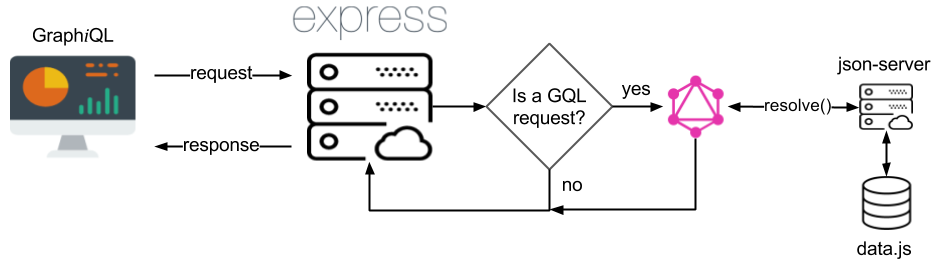

## Recursos necesarios

Para el desarrollo de la charla/taller, se recomienda que dispongas de las siguientes herramientas en el equipo informático donde vayas a trabajar:

- Gestor de versiones [Git](https://git-scm.com/), versión 2.7 o superior.
- [NodeJS](https://nodejs.org/es/download/current/), versión 7.0 o superior.
- Navegador web [Google Chrome](https://www.google.es/chrome/browser/desktop/index.html), versión 58.0 o superior.
- Editor de código [Visual Studio Code](https://code.visualstudio.com/), versión 1.13 o superior, con las siguientes extensiones instaladas:
    - [ESLint](https://marketplace.visualstudio.com/items?itemName=dbaeumer.vscode-eslint).
    - [GraphQL for VSCode](https://marketplace.visualstudio.com/items?itemName=kumar-harsh.graphql-for-vscode).
    - [npm Intellisense](https://marketplace.visualstudio.com/items?itemName=christian-kohler.npm-intellisense).

## Introducción

Este repositorio contiene el código necesario para llevar a cabo un taller introductorio a GrpahQL desde el lado del servidor.

El objetivo de dicho código será crear una aplicación en NodeJS con la cual, podremos registrar películas, directores, guionistas, géneros cinematográficos así como actores y actrices, en un segundo servidor cuya única función será la de proveer datos. Dicho servidor estará basado en [json-server](https://github.com/typicode/json-server).

Una vez dicho esto, el diagrama de la infraestructura que vamos a emplear será el siguiente:



Si no entiendes alguno de los elementos mostrados en el esquema, por favor, no te preocupes, los abordaremos durante el taller.

## Configuración del entorno

Una vez expuesto lo que vamos a hacer en el taller, es hora de configurar el entorno de trabajo.

#### Servidor de datos

Lo primero es descargar el servidor que contiene los datos de las películas que vamos a consumir desde GraphQL. Para ello, debes seguir estos pasos:

```sh
$ git clone https://github.com/ddialar/js.json-server.movies.git movies-server
$ cd movies-server
$ npm install
$ npm run json_server
```

Si quieres más información acerca de cómo funciona este servidor, te invito a que accedas a la [página de inicio](https://github.com/ddialar/js.json-server.movies.git#readme) del repositorio.

#### Servidor GraphQL

Este será el servidor cuyas funcionalidades iremos implementando durante el taller.

Para configurar el entorno, primero debes estar fuera del directorio donde tienes el servidor de películas y a continuación, debes seguir estos pasos:

```sh
$ git clone https://github.com/ddialar/graphql.tlp17.server.git graphql-server
$ cd graphql-server
$ npm install
```

Si todo ha ido bien, ya tendrás listo en entorno necesario para poder trabajar durante el taller.

## Organización del taller

Empezaremos el taller con una breve presentación que nos permitirá dos cosas:

1. Exponer los conceptos básicos de GraphQL con los que vamos a trabajar.
2. Permitir a aquellas personas que no hayan podido configurar el entorno de trabajo, hacerlo antes de empezar a programar.

Una vez concluída la presentación inicial, comenzaremos a trabajar en el código.